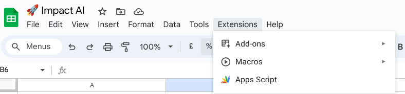
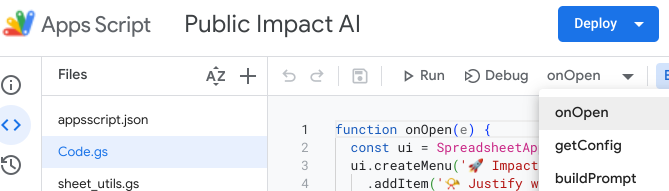
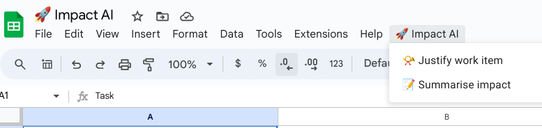

# Impact AI
Use Google Workspace and Gemini to automatically show your impact.

## Recommend some coding experience and a Google Cloud account to replicate.

https://developers.google.com/apps-script/guides/sheets

# 1. Make a copy of [this example sheet](https://docs.google.com/spreadsheets/d/1PVgzG0hnAGUg5Gpgs53CFKzR4r-78aqy9PnrwrVmf_w/edit?usp=sharing).

If that is not avalible, setup a new Google Sheet with teh following sheets:

#### Sheet named "Tasks"

|Task|Impact|
|-|-|
| Fixed a bug | "Fixed a bug impacting [Functionality] within the application, improving user experience and ensuring seamless application performance. This aligns with the core responsibilities of a Junior Software Engineer to maintain existing software and resolve user-reported issues.|

#### Sheet named "Config"

|Job spec|Impact Prompt|Summary Prompt|
|-|-|-|
| Job Title: Junior Software Engineer Department: Engineering/Technology  Reports To: Senior Software Engineer or Engineering Manager  Summary:  The Junior Software Engineer is an entry-level position responsible for developing and maintaining software applications under the guidance of senior engineers. The role involves learning and applying programming skills, collaborating with the development team, and contributing to the successful delivery of projects.  Key Responsibilities:  Software Development:  Write clean, well-structured, and maintainable code according to established coding standards and best practices Assist in the development of new features and functionalities for existing software applications Participate in code reviews to ensure code quality and adherence to standards Fix bugs and resolve issues reported by users or the QA team  Collaboration and Learning:  Work collaboratively with the development team to understand project requirements and design solutions Actively seek mentorship and guidance from senior engineers to enhance technical skills and knowledge Stay up-to-date with the latest technologies, programming languages, and industry trends through continuous learning  Testing and Quality Assurance:  Write and execute unit tests to ensure code functionality and reliability Assist in the testing and quality assurance process to identify and resolve potential issues  Other:  Participate in team meetings, sprint planning, and other Agile development activities Document code and technical solutions as needed Perform any other duties assigned by the supervisor or manager |Your task is to rewrite a  completed task description in order to properly validate why the task was impactful based on the job spec.     Job spec:   {{JOB_SPEC}}   ---end of job spec---     Completed task description:   {{TASK_DESCRIPTION}}   --- end of task description ---     The new task description should be only a couple of lines long and consise of what was done and why it is so impactful to the role.     Use more buinessy language that would catch the attention of managers as someon who should be promoted.     If the task isn't relevant then output ""⚠️ Sorry this task is not relevant to job."", and explain why     Just output plain unformatted text.     Plain output:| Your task is to summarize the following task that where completed:   {{TASKS}}   ---end of task list---     Output in plain text and newlines.     Make it sound impactful.     Summary: |

# 2. Add AppScript to the Spreadsheet

By clicking  **Extentions** > **Apps Script**

# 3. Adding all the AppScript code 

Paste all the code from the [appscript folder](/appscript) into the appscript editor.

# 4. Add your Google Cloud Service Account json 

In a Google Cloud project , create a service account json file that has Vertex AI prediction permissions. Paste the json contents into the [auth.gs](/appscript/auth.gs) code.   

# 5. Initilise the script 

In the AppScript console, **run** the `onOpen` function once manually.

# 6. You're ready for impact
There should now be a new tool bar, you can enter a new task and whilst its selected click `Justify work item` to generate impact. You can also highlight multiple Impact rows and have them summarised.

